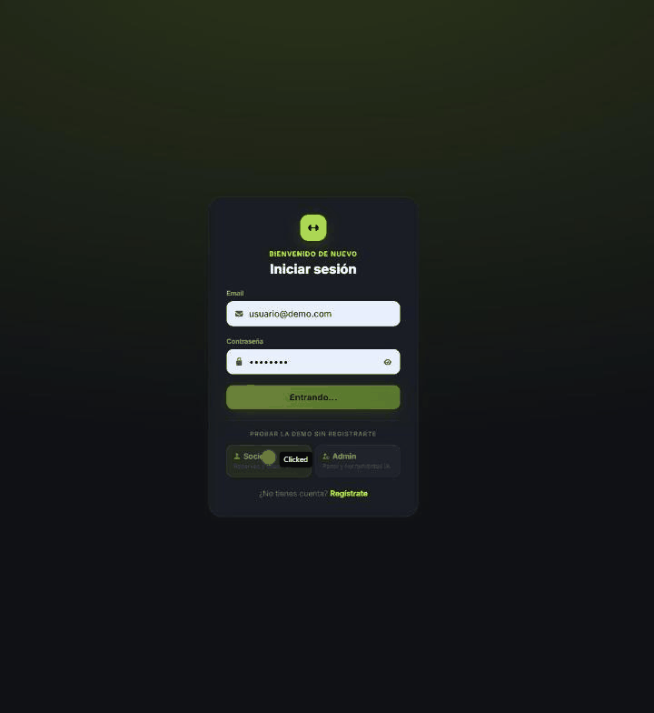
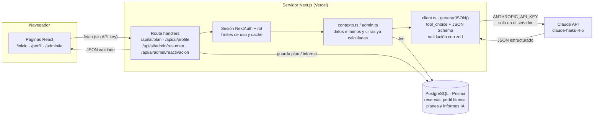

# Gimnasio App · reservas de clases con asistente IA (Claude)

PWA para un gimnasio pequeño de clases reducidas (máx. 4 personas): los socios reservan y cancelan clases, el administrador gestiona clases, pagos y usuarios, y **un asistente con IA (Claude API)** hace de entrenador para el socio y de analista para el dueño.

**[▶ Probar la demo](https://gimnasio-app-livid.vercel.app)** — entra con un clic como *Socio* o *Admin*, sin registrarte.



`Next.js 14` · `TypeScript` · `Prisma` · `PostgreSQL (Supabase)` · `NextAuth` · `Tailwind` · `Claude API (@anthropic-ai/sdk)` · `zod` · `Vercel`

---

## Asistente IA

| Para quién | Qué hace |
|---|---|
| **Socio** (`/inicio`, `/perfil`) | Rellena un mini cuestionario (objetivo, nivel, duración, alimentación) y recibe un **plan de entreno semanal** ajustado a su tarifa (1, 2 o 3 días) y a su asistencia real, más **sugerencias de nutrición**. |
| **Admin** (`/admin/ia`) | **Resumen semanal** con lo que va bien, lo que preocupa y 3 acciones concretas, a partir de ocupación, pagos y gastos. |
| **Admin** (`/admin/ia`) | **Socios a reactivar** (no vienen, cuota vencida, cancelaciones tardías): la IA redacta un aviso personal para cada uno y el admin lo revisa antes de enviarlo. |

### Cómo está montado



1. La página pide un plan o un resumen a una ruta propia de la app; el navegador nunca habla con Claude.
2. La ruta comprueba la sesión (y el rol `ADMIN` en las de admin) y los límites de uso.
3. Se construye el contexto con Prisma: solo lo necesario (nombre de pila, tarifa, asistencia, cuestionario). Las cifras del admin (ocupación, ingresos, gastos) se calculan en código, no las calcula la IA.
4. `generarJSON()` llama a Claude obligándole a usar una *tool* con JSON Schema y valida la respuesta con zod. Si no cuadra, la ruta devuelve error en lugar de pintar algo roto.
5. El resultado se guarda en BD (`AiPlan`, `AiReport`) y la interfaz lo pinta como tarjetas, no como texto plano.

Código: [`src/lib/ai/`](src/lib/ai) (cliente, contexto del socio, prompts de coach y admin) y [`src/app/api/ai/`](src/app/api/ai).

### Decisiones técnicas

**¿Por qué Claude?**
- **Salidas estructuradas fiables.** En vez de pedir "devuélveme JSON" y parsear texto, defino una *tool* con su JSON Schema y fuerzo su uso con `tool_choice`. La API devuelve directamente el objeto, y zod lo valida en mi lado.
- **Buen español y buen tono** para mensajes que lee un socio real (cercano, sin inventar diagnósticos ni suplementos: está prohibido en el *system prompt*).
- **Haiku 4.5 es rápido y barato**, suficiente para planes y avisos cortos de un gimnasio pequeño. El modelo se cambia con `ANTHROPIC_MODEL` sin tocar código.
- **Un único punto de contacto** (`client.ts`): cambiar de modelo o de proveedor afecta a un archivo, no a toda la app.

**¿Cómo protejo la API key?**
- `ANTHROPIC_API_KEY` solo se lee en `src/lib/ai/client.ts`, que solo se importa desde *route handlers* del servidor. No lleva prefijo `NEXT_PUBLIC_`, así que Next.js nunca la mete en el JavaScript del navegador.
- En local vive en `.env` (en `.gitignore`); en producción es una variable **Secret** de Vercel.
- Las rutas de IA exigen sesión de NextAuth, y las de admin además rol `ADMIN`: el middleware protege las páginas `/admin/*` y cada ruta de API vuelve a comprobar la sesión y el rol por su cuenta.
- **Mínimo dato posible a la IA:** nunca se envían emails, pagos ni datos que no hagan falta para personalizar.
- Si falta la key, la app funciona igual y simplemente oculta las funciones de IA.

**¿Cómo controlo el gasto?**
- **Límites por socio:** 3 generaciones por tipo de plan y semana (la API responde `429` al pasarse).
- **Caché del resumen del admin:** 12 h en BD, y como mínimo 10 min entre refrescos manuales.
- **Tope diario** de avisos de reactivación: `AI_ADMIN_DAILY_LIMIT` (20 por defecto).
- **`max_tokens` acotado** en cada llamada (1.500–3.000) y modelo pequeño por defecto.
- **La IA no hace lo que el código hace gratis:** los candidatos a reactivar se detectan con reglas y las cifras se calculan con Prisma. La IA solo redacta e interpreta, lo que ahorra tokens y evita números inventados.

### Próximos pasos de la IA
- *Tool use* para que el socio reserve hablando ("apúntame mañana a las 19:00").
- Respuestas en *streaming*.
- *Prompt caching* y registro de tokens por función.
- Batería de 10–15 perfiles de socio de prueba para evaluar cada cambio de prompt.

---

## La app

### Roles

**Administrador**
- Crea clases (también recurrentes por día de la semana), ve el aforo y quién va a cada una.
- Gestiona pagos y gastos, y puede dar de alta usuarios manualmente.

**Socio**
- Reserva y cancela clases dentro de su tarifa.
- Si cancela con **menos de 3 h de antelación**, pierde ese día (cuenta como usado).
- Si cancela con **3 h o más**, el hueco se libera para otro socio y no pierde el día.

### Reglas de negocio clave
- Tarifas de **1, 2 o 3 días/semana**.
- Reservar ocupa un hueco de aforo (máx. 4); cancelar a tiempo lo libera para futuras reservas.
- Lógica centralizada en [`src/lib/booking-logic.ts`](src/lib/booking-logic.ts).

### Stack
- **Next.js 14** (App Router) + TypeScript, **Tailwind CSS**
- **Prisma** + **PostgreSQL** (Supabase)
- **NextAuth.js** (JWT, roles admin / socio)
- **Claude API** (`@anthropic-ai/sdk`) + **zod**
- **next-pwa**: instalable en el móvil sin pasar por las tiendas de apps
- Despliegue en **Vercel**, con un Cron Job que mantiene despierta la BD gratuita de Supabase

### Estructura
```
src/
  app/
    (admin)/admin/   -> panel del admin (clases, usuarios, pagos, IA)
    (user)/          -> inicio, mis-clases y perfil del socio
    (auth)/          -> login / registro
    api/             -> endpoints (auth, bookings, classes, users, ai)
  components/        -> componentes reutilizables
  lib/               -> lógica de negocio, auth, Prisma
    ai/              -> cliente de Claude, contexto y prompts
prisma/
  schema.prisma      -> modelo de datos
  seed-demo.js       -> datos de la demo pública
```

### Puesta en marcha
```bash
npm install
cp .env.example .env   # rellenar con tus credenciales
npx prisma migrate dev
npm run dev
```

Variables de la IA: `ANTHROPIC_API_KEY` (activa la IA), `ANTHROPIC_MODEL` (opcional, por defecto `claude-haiku-4-5`) y `AI_ADMIN_DAILY_LIMIT` (opcional, por defecto 20).

### Demo pública
- `NEXT_PUBLIC_DEMO_MODE=true` muestra en `/login` los botones para entrar como **Socio** o **Admin** de demo.
- `npm run seed:demo` (apuntando a la BD de la demo) crea 6 semanas de historial y socios con situaciones reales: uno que ha dejado de venir, cuota vencida, cancelaciones tardías y cuota a punto de vencer.
- Credenciales: `usuario@demo.com` / `admin@demo.com`, contraseña `Demo1234`.
- `EMAIL_VERIFICATION_ENABLED=true` reactiva la confirmación por email (desactivada por defecto).

### Flujo de trabajo en Git
- `main` siempre estable: es lo que está en producción y Vercel lo despliega solo.
- Una rama por funcionalidad (`feature/...`, `fix/...`, `docs/...`) y Pull Request contra `main`.
